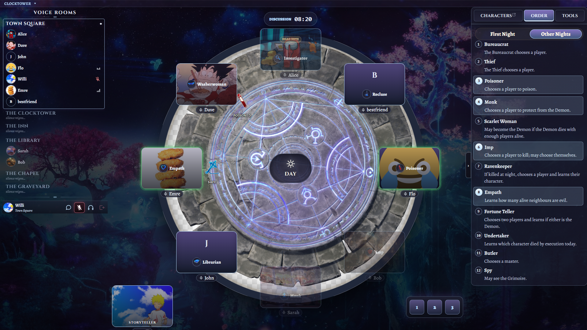
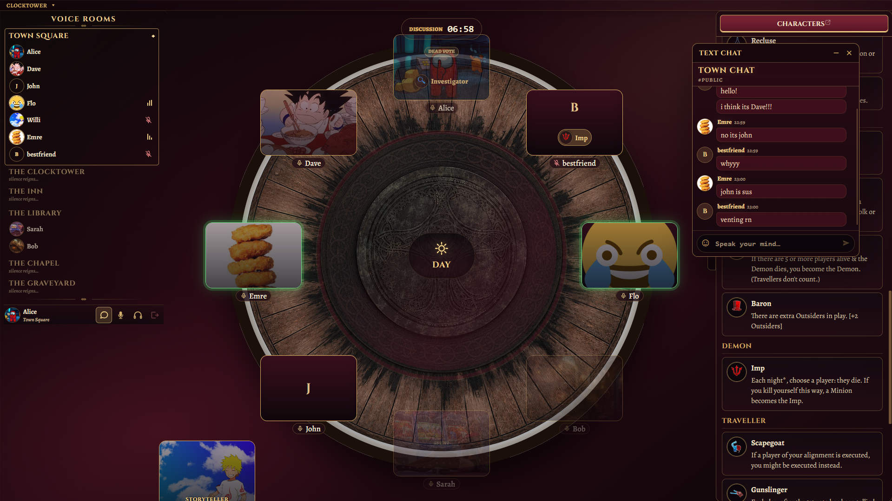

# Open Clocktower

Open Clocktower is a self-hosted browser app for live, storyteller-led social deduction games.

It provides a shared digital table with rooms, seats, phases, nominations, voting, reminders, private notes, text chat, voice rooms, timers, and custom character packs. The app is designed for private groups that want to host their own online or hybrid game nights.

## Screenshots

These screenshots show a test room with locally uploaded demo content. Open Clocktower does not ship official game content, artwork, logos, rules text, or character packs.

| Storyteller view | Player view |
| --- | --- |
|  |  |

## What It Provides

- private rooms with short room codes
- player seating around a shared table
- storyteller-controlled phase and nomination flow
- hidden character assignments and demon bluffs
- character sheet, night order, and reminder token dashboards
- local player notes, suspicions, and table reminders
- public and private text chat
- WebRTC voice rooms with browser-side audio settings
- room-local character pack uploads

Players do not need accounts. A browser receives private session credentials when it creates or joins a room, and those credentials are used for later actions.

## Content

Open Clocktower does not include official game content, protected artwork, logos, rules text, or character packs. Server operators and storytellers are responsible for the content they upload to their own instance.

Character packs are uploaded per room and may contain custom scripts, homebrew content, translated text, icons, reminder tokens, and night order data.

See [Character Packs](docs/character-packs.md) for the supported format and upload limits.

## Local Run

You need Docker and Docker Compose.

```bash
docker compose up --build
```

Open:

```text
http://localhost:3000
```

For frontend hot reload and development checks, see [Development](docs/development.md).

## Production

The production stack is intended to run one app container behind an HTTPS reverse proxy and one internal PostgreSQL container. The default production image tag should be `latest` unless you deliberately pin a known-good image for rollback.

Example domain used throughout the docs:

```text
clocktower.example.com
```

Basic production flow:

```bash
cp .env.production.example .env
docker compose -f docker-compose.prod.yml pull
docker compose -f docker-compose.prod.yml up -d
```

Before starting, set at least:

```env
OPEN_CLOCKTOWER_IMAGE=willi28/open-clocktower:latest
APP_DOMAIN=clocktower.example.com
POSTGRES_PASSWORD=use-a-long-random-password
```

For the full setup, security checklist, voice/TURN notes, and backup guidance, see [Deployment](docs/deployment.md).

## Documentation

- [Deployment](docs/deployment.md)
- [Development](docs/development.md)
- [Webapp Structure](docs/webapp-structure.md)
- [Character Packs](docs/character-packs.md)
- [API & Events](docs/api-events.md)
- [Voice Audio](docs/voice-audio.md)

## Operational Status

Open Clocktower is suitable for small self-hosted sessions. The current deployment model should run as a single app container because WebSocket connections, timers, voice signaling, and some room runtime state are process-local. Scale-out requires a shared realtime/state layer before multiple app replicas are safe.
